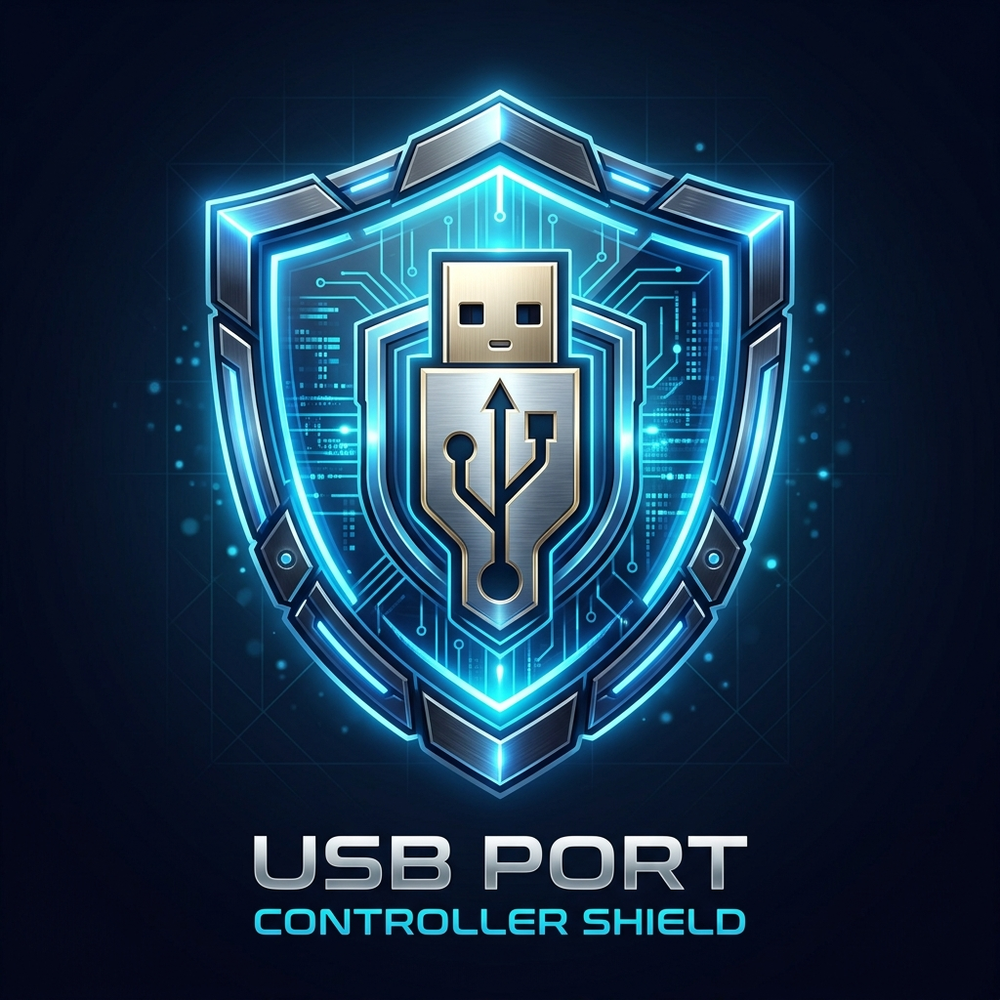

<p align="center">
  
</p>

<h1 align="center">🛡️ USB Port Controller Shield (Enterprise Edition)</h1>
<h3 align="center">درع أمني احترافي متكامل للتحكم في منافذ USB ومراقبة الأجهزة وحماية البيانات لنظام Windows</h3>

<p align="center">
  
  
  
  
  
  
</p>

---

## 📖 حول المشروع (About The Project)

**USB Port Controller Shield** هو نظام أمني سيبراني متطور مصمم لحماية أجهزة الكمبيوتر ومحطات العمل من تسريب البيانات واختراق الفلاشات. يتيح لك البرنامج التحكم الكامل في منافذ الـ USB عبر إيقافها كلياً، أو تفعيل وضع **القراءة فقط (Read-Only)**، مع تسجيل كامل لجميع الأحداث الأمنية، ومؤقت ذكي للقفل التلقائي، وتنبيهات فورية عبر Telegram.

---

## ✨ المميزات الشاملة (Enterprise Features)

- 🔒 **حماية بكلمة سر رئيسية مشفرة**: تشفير قوي باستخدام خوارزمية **`SHA-256`** مع نظام التمليح **`Salt`** لمنع أي تلاعب غير مصرح به.
- 💾 **حظر وتمكين منافذ الفلاشات فورياً**: إيقاف تشغيل منافذ الـ USB التخزينية فورياً عبر سجل النظام `USBSTOR`.
- ✍️ **وضع الحماية من النسخ (Write-Protection)**: السماح بقراءة وتصفح الفلاشة مع منع كتابة أو نسخ أو تعديل أي ملف عليها منعاً لتسريب البيانات الحساسة.
- 📋 **سجل النشاط والأحداث الأمنية (Security Event Logs)**: تسجيل كل نشاط على الجهاز (توصيل/فصل أجهزة، محاولات الدخول الخاطئة، تغيير الإعدادات) مع إمكانية تصدير التقرير إلى ملف `CSV` أو `TXT`.
- ⏳ **مؤقت الفتح المؤقت والقفل الذاتي (Auto-Lock Timer)**: فتح المنافذ لفترة محددة (5 دقائق، 15 دقيقة، 30 دقيقة، 1 ساعة) مع عد تنازلي حي، وإعادة قفلها تلقائياً عند انتهاء الوقت.
- 🔔 **تنبيهات وبصمة الأجهزة المتعددة (Multi-Device Fingerprint Alerts)**: إرسال تفاصيل الجهاز الفريدة مع كل إشعار (اسم الكمبيوتر، المستخدم النشط، وعنوان IP).
- 🎮 **التحكم الأمني عن بُعد عبر Telegram (2-Way Remote Control Bot)**: تحكم كامل بمنافذ أجهزتك من أي مكان عبر إرسال أوامر للبوت:
  - `/status` : عرض تقرير حي لحالة المنافذ والحماية.
  - `/lock` : قفل منافذ USB فورياً.
  - `/unlock` : فتح منافذ USB فورياً.
  - `/timer 15` : فتح مؤقت لمدة محددة ثم القفل التلقائي الذاتي.
  - `/wp_on` و `/wp_off` : تفعيل أو تعطيل وضع الحماية من النسخ (Read-Only).
  - إمكانية توجيه الأمر لجهاز محدد بالاسم (مثال: `/lock PC-SALES-01`).
- 🌐 **واجهة ثنائية اللغة (Arabic / English)**: تبديل فوري بنقرة زر واحدة مع ضبط اتجاه الواجهة (`RTL` / `LTR`).
- 🔄 **حماية مستمرة مع إقلاع النظام (Auto-Start)**: تشغيل دائم في الخلفية مع شريط المهام بجانب الساعة (System Tray).
- 🔌 **مراقبة حية للأجهزة المتصلة**: اكتشاف تلقائي وتنبيه فوري عند إدخال أو فصل أي جهاز USB.
- 🖥️ **توافق مع دقة الشاشات (Per-Monitor High-DPI Scaling)**: واجهة واضحة ونقية بدون أي ضبابية على شاشات 1080p و 2K و 4K ومختلف نسب التكبير.
- 📦 **معالج تثبيت رسمي مدمج (Setup Installer)**: لتنصيب التطبيق في مسار برامج الويندوز وإنشاء الاختصارات ودعم إلغاء التثبيت النظيف (Add/Remove Programs).
- 🤖 **أتمتة التجميع والإصدارات (CI/CD GitHub Actions)**: تجميع تلقائي للملفات التنفيذية ورفعها لصفحة الإصدارات فورياً.

---

## 🚀 طريقة التجميع والتشغيل (How to Build & Run)

المشروع مصمم ليعمل بدون الحاجة لتثبيت برامج ثقيلة، يمكنك تجميعه مباشرة عبر مترجم السي شارب المدمج في نظام ويندوز:

1. **حمّل المستودع أو انسخه**:
   ```bash
   git clone https://github.com/AzamAhmed77/USB-Port-Shield.git
   ```

2. **تجميع المشروع**:
   - شغّل الملف `build.bat` بالنقر المزدوج عليه.
   - سيتم تجميع البرنامجين تلقائياً:
     - `USBController.exe` : التطبيق الرئيسي (جاهز للعمل المباشر كأداة محمولة Portable).
     - `Setup.exe` : معالج التثبيت الرسمي لتنصيب البرنامج في النظام.

---

## 🛠️ متطلبات التشغيل (System Requirements)

- **أنظمة التشغيل المدعومة**: Windows 7 / 8 / 8.1 / 10 / 11 / Windows Server (32-bit & 64-bit).
- **بيئة التشغيل**: .NET Framework 4.0 أو أحدث (مدمج تلقائياً في جميع إصدارات ويندوز الحديثة).
- **صلاحيات التشغيل**: يتطلب صلاحيات مسؤول (Administrator) للتحكم في سجل النظام ومنافذ الـ USB.

---

## 👤 المطور (Developer)

- **GitHub**: [@AzamAhmed77](https://github.com/AzamAhmed77)
- **Project**: [USB-Port-Shield](https://github.com/AzamAhmed77/USB-Port-Shield)
